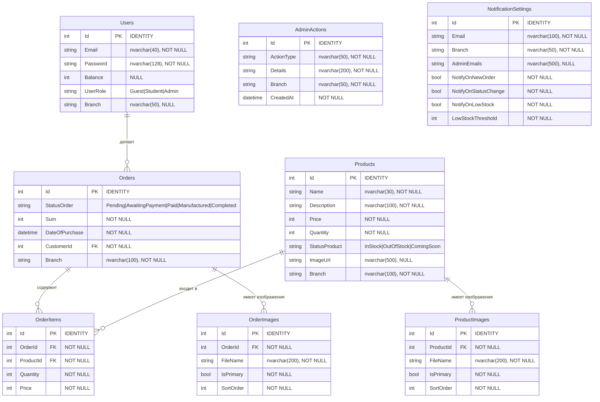

# ER-диаграмма CifraShop

## Текстовое описание схемы

### Таблица: Users

| Столбец   | Тип             | Constraints           | Описание                          |
|-----------|-----------------|-----------------------|-----------------------------------|
| Id        | int             | PK, IDENTITY          | Уникальный идентификатор          |
| Email     | nvarchar(40)    | NOT NULL              | Email пользователя                |
| Password  | nvarchar(128)   | NOT NULL              | Хеш пароля                        |
| Balance   | int             | NULL                  | Баланс пользователя               |
| UserRole  | nvarchar        | NOT NULL              | Роль: Guest / Student / Admin     |
| Branch    | nvarchar(50)    | NULL                  | Филиал пользователя               |

### Таблица: Products

| Столбец    | Тип             | Constraints                     | Описание                          |
|------------|-----------------|---------------------------------|-----------------------------------|
| Id         | int             | PK, IDENTITY                    | Уникальный идентификатор          |
| Name       | nvarchar(30)    | NOT NULL                        | Название товара                   |
| Description| nvarchar(100)   | NOT NULL                        | Описание товара                   |
| Price      | int             | NOT NULL                        | Цена товара                       |
| Quantity   | int             | NOT NULL                        | Количество на складе              |
| StatusProduct | nvarchar     | NOT NULL                        | InStock / OutOfStock / ComingSoon |
| ImageUrl   | nvarchar(500)   | NULL                            | URL основного изображения         |
| Branch     | nvarchar(100)   | NOT NULL, DEFAULT ''            | Филиал товара                     |

### Таблица: Orders

| Столбец        | Тип             | Constraints                     | Описание                          |
|----------------|-----------------|---------------------------------|-----------------------------------|
| Id             | int             | PK, IDENTITY                    | Уникальный идентификатор          |
| StatusOrder    | nvarchar        | NOT NULL                        | Pending / AwaitingPayment / Paid / Manufactured / Completed |
| Sum            | int             | NOT NULL                        | Общая сумма заказа                |
| DateOfPurchase | datetime2       | NOT NULL                        | Дата покупки                      |
| CustomerId     | int             | FK → Users.Id, NOT NULL         | Ссылка на покупателя              |
| Branch         | nvarchar(100)   | NOT NULL, DEFAULT ''            | Филиал заказа                     |

### Таблица: OrderItems

| Столбец    | Тип     | Constraints                     | Описание                          |
|------------|---------|---------------------------------|-----------------------------------|
| Id         | int     | PK, IDENTITY                    | Уникальный идентификатор          |
| OrderId    | int     | FK → Orders.Id, NOT NULL        | Ссылка на заказ                   |
| ProductId  | int     | FK → Products.Id, NOT NULL      | Ссылка на товар                   |
| Quantity   | int     | NOT NULL                        | Количество в позиции              |
| Price      | int     | NOT NULL                        | Цена на момент заказа             |

### Таблица: ProductImages

| Столбец    | Тип             | Constraints                     | Описание                          |
|------------|-----------------|---------------------------------|-----------------------------------|
| Id         | int             | PK, IDENTITY                    | Уникальный идентификатор          |
| ProductId  | int             | FK → Products.Id, NOT NULL      | Ссылка на товар                   |
| FileName   | nvarchar(200)   | NOT NULL                        | Имя файла изображения             |
| IsPrimary  | bool            | NOT NULL                        | Основное изображение?             |
| SortOrder  | int             | NOT NULL                        | Порядок сортировки                |

### Таблица: OrderImages

| Столбец    | Тип             | Constraints                     | Описание                          |
|------------|-----------------|---------------------------------|-----------------------------------|
| Id         | int             | PK, IDENTITY                    | Уникальный идентификатор          |
| OrderId    | int             | FK → Orders.Id, NOT NULL        | Ссылка на заказ                   |
| FileName   | nvarchar(200)   | NOT NULL                        | Имя файла изображения             |
| IsPrimary  | bool            | NOT NULL                        | Основное изображение?             |
| SortOrder  | int             | NOT NULL                        | Порядок сортировки                |

### Таблица: AdminActions

| Столбец     | Тип             | Constraints                     | Описание                          |
|-------------|-----------------|---------------------------------|-----------------------------------|
| Id          | int             | PK, IDENTITY                    | Уникальный идентификатор          |
| ActionType  | nvarchar(50)    | NOT NULL                        | Тип действия                      |
| Details     | nvarchar(200)   | NOT NULL                        | Детали действия                   |
| Branch      | nvarchar(50)    | NOT NULL, DEFAULT ''            | Филиал                            |
| CreatedAt   | datetime2       | NOT NULL                        | Дата создания                     |

### Таблица: NotificationSettings

| Столбец              | Тип             | Constraints                     | Описание                          |
|----------------------|-----------------|---------------------------------|-----------------------------------|
| Id                   | int             | PK, IDENTITY                    | Уникальный идентификатор          |
| Email                | nvarchar(100)   | NOT NULL                        | Email для уведомлений             |
| Branch               | nvarchar(50)    | NOT NULL                        | Филиал                            |
| AdminEmails          | nvarchar(500)   | NULL                            | Email'ы админов через запятую     |
| NotifyOnNewOrder     | bool            | NOT NULL                        | Уведомлять о новом заказе         |
| NotifyOnStatusChange | bool            | NOT NULL                        | Уведомлять об изменении статуса   |
| NotifyOnLowStock     | bool            | NOT NULL                        | Уведомлять о низком остатке       |
| LowStockThreshold    | int             | NOT NULL                        | Порог низкого остатка             |

---

## Связи между таблицами

```
Users 1 ──── N Orders        (Restrict: нельзя удалить пользователя с заказами)
Orders 1 ──── N OrderItems   (Cascade: удаление заказа удаляет его позиции)
Orders 1 ──── N OrderImages  (Cascade: удаление заказа удаляет его изображения)
Products 1 ──── N OrderItems (Restrict: нельзя удалить товар, ссылающийся в заказах)
Products 1 ──── N ProductImages (Cascade: удаление товара удаляет его изображения)
```

---

## Mermaid-диаграмма



> **Примечание:** `AdminActions` и `NotificationSettings` — изолированные таблицы без внешних ключей на другие сущности. Они связаны с другими таблицами только логически (по полю `Branch`).

---

# Архитектура проекта CifraShop

## Паттерн

Проект построен по принципу **Clean Architecture** — каждый слой зависит только от нижележащих и не имеет обратных зависимостей. Это обеспечивает разделение ответственности и удобство тестирования.

## Структура решения

Решение содержит 8 проектов, объединённых в файл `CifraShop.slnx` (формат .NET 10).

### 1. CifraShop.Domain

Самый нижний слой. Содержит бизнес-сущности проекта: `User`, `Product`, `Order`, `OrderItem`, `ProductImage`, `OrderImage`, `AdminAction`, `NotificationSettings`. Также здесь определены перечисления `UserRole` (Guest / Student / Admin), `StatusProduct` (InStock / OutOfStock / ComingSoon), `StatusOrder` (Pending / AwaitingPayment / Paid / Manufactured / Completed) и интерфейсы репозиториев (`IUserRepository`, `IProductRepository`, `IOrderRepository` и т.д.). Этот проект не зависит ни от одного другого проекта в решении.

### 2. CifraShop.Contracts

Слой DTO (объектов передачи данных). Содержит модели запросов и ответов для API, а также мапперы для преобразования сущностей в DTO и обратно. Зависит от Domain.

### 3. CifraShop.Application

Бизнес-логика. Содержит сервисы с интерфейсами и реализациями: `ProductService`, `OrderService`, `UserService`, `OrderItemService`, `OrderImageService`, `AdminActionService`, `NotificationSettingsService`, `AuthService`. Также здесь находится `NotificationDispatcher`, координирующий email-уведомления, и `SmtpSettings` — модель настроек SMTP. Зависит от Domain и Contracts.

### 4. CifraShop.Infrastructure

Реализация доступа к данным и внешним сервисам. Содержит `ApplicationContext` (EF Core DbContext), реализации репозиториев (`UserRepositoryEfCore`, `ProductRepositoryEfCore`, `OrderRepositoryEfCore` и др.), конфигурации сущностей для EF Core (`UserConfiguration`, `ProductConfiguration` и т.д.), а также `EmailService` для отправки писем через SMTP. Зависит от Domain и Application.

### 5. CifraShop.API

Точка входа бэкенда. ASP.NET Core приложение на порту 5000. Содержит 10 контроллеров (`AuthController`, `ProductController`, `OrderController`, `UserController`, `OrderItemController`, `OrderImageController`, `ProductImageController`, `AdminActionController`, `NotificationSettingsController`, `BranchController`), два SignalR Hub (`AdminHub` на `/hubs/admin` и `ShopHub` на `/hubs/shop`), middleware для обработки исключений и регистрацию зависимостей (DI). Здесь же происходит автоматическое применение миграций при старте через `DatabaseInitializer`. Зависит от Application, Contracts и Infrastructure.

### 6. CifraShop.Client

Отдельный процесс — Blazor WebAssembly приложение на порту 5001. Содержит свои сервисы: `AuthService` (JWT-авторизация), `CartService` (корзина), `SignalRService` (real-time для админ-панели), `ShopSignalRService` (real-time для магазина). Все запросы к API идут через `HttpClient` с адресом `http://localhost:5000/`. Клиент не связан с серверным кодом напрямую — только через HTTP и WebSocket.

### 7. CifraShop.Launcher

CLI-утилита для запуска всего стека. Управляет Docker-контейнерами, запускает миграции, стартует API и Client. Поддерживает флаги: `--quick` (пропустить завершённые шаги), `--skip-docker`, `--status`, `--reset`, `--port-api`, `--port-client`, `--port-db`.

### 8. CifraShop.Tests

Тесты на xUnit + Moq + EF Core InMemory. Организованы по слоям: `ServiceTests` (тестирование бизнес-логики с моками репозиториев), `RepositoryTests` (тестирование с InMemory БД), `ControllerTests` (интеграционные тесты контроллеров), `AuthTests` (тестирование авторизации). Тесты не требуют запущенной SQL Server.

## Порядок зависимостей

Зависимости направлены строго вниз: API → Application → Domain. Infrastructure зависит от Domain и Application. Contracts зависит от Domain. Client общается с API только по HTTP. Launcher не зависит от бизнес-проектов — он управляет инфраструктурой.

## Потоки данных

### Обработка запроса

Когда Blazor-клиент отправляет HTTP-запрос (например, GET /api/products), он попадает в соответствующий контроллер в API. Контроллер вызывает сервис из Application-слоя. Сервис обращается к интерфейсу репозитория, реализация которого находится в Infrastructure и работает через EF Core с SQL Server. Результат возвращается обратно по цепочке: репозиторий → сервис → контроллер → клиент.

### Real-time уведомления

Два SignalR Hub обеспечивают push-уведомления. `AdminHub` на `/hubs/admin` отправляет обновления админ-панели (изменение статуса заказа, новые заказы). `ShopHub` на `/hubs/shop` оповещает покупателей об изменениях наличия и цен. Blazor-клиент подключается к обоим хабам через специализированные сервисы `SignalRService` и `ShopSignalRService`.

### Email-уведомления

При создании или изменении заказа `OrderService` вызывает `NotificationDispatcher`. Диспетчер загружает настройки уведомлений из таблицы `NotificationSettings` (по филиалу), проверяет флаги (`NotifyOnNewOrder`, `NotifyOnStatusChange`, `NotifyOnLowStock`) и порог остатка. Если условия выполнены, через `EmailService` отправляется письмо по SMTP. В dev-окружении письма перехватываются Mailhog (SMTP на порту 1025, веб-интерфейс на порту 8025).

## Инфраструктура

Весь стек развёртывания управляется через Docker Compose. SQL Server 2022 (Express) работает на порту 1433, API — на порту 5000 (изнутри контейнера 8086), Mailhog — на портах 1025 (SMTP) и 8025 (UI). База данных `CifraShopDb` создаётся автоматически, миграции применяются при старте API через `DatabaseInitializer` с механизмом повторных попыток (до 15 попыток).

## Авторизация

Используется JWT Bearer Token. При входе `AuthService` проверяет учётные данные, генерирует токен с клавишей из конфигурации (`Jwt:Key`). Контроллеры помечаются атрибутами `[Authorize]` для защиты эндпоинтов. Роли (Guest, Student, Admin) влияют на доступ к определённым операциям.

---

# Use Case диаграмма CifraShop

## Акторы (роли)

### Гость (Guest)
Неавторизованный пользователь. Может просматривать товары, входить в систему и регистрироваться как студент.

### Студент (Student)
Авторизованный покупатель. Может просматривать профиль, искать и заказывать товары, просматривать историю заказов.

### Администратор (Admin)
Управляет всем магазином. Создаёт, редактирует и удаляет товары, управляет заказами, пользователями, изображениями, настройками уведомлений и просматривает лог действий.

### Система (System)
Автоматические процессы: отправка email-уведомлений, применение миграций БД, push-обновления через SignalR.

---

## Use Cases по акторам

### Гость (Guest)
1. Получить гостевой токен — анонимный доступ к каталогу товаров
2. Войти в систему — ввод email и пароля, получение JWT
3. Зарегистрироваться как студент — создание нового аккаунта

### Студент (Student)
4. Просмотреть профиль — свои данные (email, роль, филиал, баланс)
5. Просмотреть каталог товаров — список с пагинацией, поиском, фильтрацией
6. Просмотреть товар — детальная информация по ID
7. Добавить товар в корзину — выбор количества
8. Оформить заказ — подтверждение покупки, списание баланса
9. Просмотреть историю заказов — список своих заказов со статусами
10. Просмотреть изображения заказа — фотографии, прикреплённые к заказу

### Администратор (Admin)
11. Управлять товарами — создание, редактирование, удаление товаров
12. Управлять изображениями товаров — загрузка, сортировка, назначение основного
13. Управлять заказами — изменение статуса (Pending → AwaitingPayment → Paid → Manufactured → Completed)
14. Управлять позициями заказа — добавление, изменение, удаление товаров в заказе
15. Управлять изображениями заказа — загрузка, сортировка фотографий к заказу
16. Управлять пользователями — создание студентов и админов, редактирование, удаление
17. Просматривать лог действий — история всех админских операций
18. Управлять настройками уведомлений — включение/выключение email-оповещений по филиалам
19. Получать real-time уведомления — push через SignalR Hub (новые заказы, смена статуса)

### Система (System)
20. Отправлять email-уведомления — при новом заказе, смене статуса, низком остатке
21. Применять миграции БД — автоматически при старте API
22. Обновлять данные в реальном времени — push через AdminHub и ShopHub

---

## Связи «включает» (include)

- «Оформить заказ» **включает** «Просмотреть корзину»
- «Управлять товарами» **включает** «Управлять изображениями товаров»
- «Управлять заказами» **включает** «Управлять позициями заказа»
- «Управлять заказами» **включает** «Управлять изображениями заказа»
- «Отправить email-уведомление» **включает** «Прочитать настройки уведомлений»

## Связи «расширяет» (extend)

- «Зарегистрироваться как студент» **расширяет** «Получить гостевой токен» — гость может перейти к регистрации
- «Просмотреть изображения товара» **расширяет** «Просмотреть товар» — дополнительная детализация

---

## Mermaid-диаграмма (для генерации изображения)

```mermaid
usecaseDiagram
    actor "Гость" as Guest
    actor "Студент" as Student
    actor "Администратор" as Admin
    actor "Система" as System

    package "CifraShop" {
        usecase "Получить гостевой токен" as UC1
        usecase "Войти в систему" as UC2
        usecase "Зарегистрироваться как студент" as UC3

        usecase "Просмотреть профиль" as UC4
        usecase "Просмотреть каталог товаров" as UC5
        usecase "Просмотреть товар" as UC6
        usecase "Добавить товар в корзину" as UC7
        usecase "Оформить заказ" as UC8
        usecase "Просмотреть историю заказов" as UC9
        usecase "Просмотреть изображения заказа" as UC10

        usecase "Управлять товарами" as UC11
        usecase "Управлять изображениями товаров" as UC12
        usecase "Управлять заказами" as UC13
        usecase "Управлять позициями заказа" as UC14
        usecase "Управлять изображениями заказа" as UC15
        usecase "Управлять пользователями" as UC16
        usecase "Просматривать лог действий" as UC17
        usecase "Управлять настройками уведомлений" as UC18
        usecase "Получать real-time уведомления" as UC19

        usecase "Отправлять email-уведомления" as UC20
        usecase "Применять миграции БД" as UC21
        usecase "Обновлять данные в реальном времени" as UC22
    }

    Guest --> UC1
    Guest --> UC2
    Guest --> UC3

    Student --> UC4
    Student --> UC5
    Student --> UC6
    Student --> UC7
    Student --> UC8
    Student --> UC9
    Student --> UC10

    Admin --> UC4
    Admin --> UC5
    Admin --> UC6
    Admin --> UC11
    Admin --> UC13
    Admin --> UC16
    Admin --> UC17
    Admin --> UC18
    Admin --> UC19

    System --> UC20
    System --> UC21
    System --> UC22

    UC8 ..> UC5 : <<include>>
    UC11 ..> UC12 : <<include>>
    UC13 ..> UC14 : <<include>>
    UC13 ..> UC15 : <<include>>
    UC20 ..> UC18 : <<include>>

    UC3 ..> UC1 : <<extend>>
    UC10 ..> UC6 : <<extend>>
```

> **Примечание:** Администратор наследует все возможности студента (просмотр каталога, профиля) плюс получает доступ к управлению. Стрелки наследования не показаны для читаемости — Admin подразумевает Student + дополнительные права.
